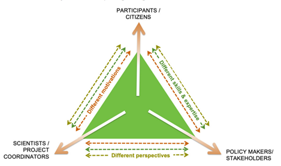

# How can we ensure that the views and interests of all stakeholders are taken into account?

## **Why is it relevant?**

As citizen observatories aim to engage and involve the broader public in the scientific process, it is crucial for organisers of COs to ensure that the views and interests of all stakeholders are considered in decision making processes. By incorporating diverse perspectives, citizen observatories can generate a more comprehensive and representative understanding of the issues at hand, while also promoting inclusivity, transparency, and democratic decision-making, fostering a sense of ownership and empowerment among participants. Additionally, different stakeholders bring unique knowledge, expertise, and experiences that can contribute to more robust and innovative solutions. By valuing and integrating the viewpoints of all individuals involved, organisers and policy makers can enhance the relevance, credibility, and effectiveness of citizen observatories, ultimately leading to better-informed decisions and positive societal outcomes.

## **How can this be done?**

Incorporating a diverse range of perspectives within a Citizen Observatory can be a challenging task, but there are effective approaches and tools available to engage with a variety of stakeholders from the outset and throughout the observatory's lifetime.

### _Participatory decision making via targeted engagement of underrepresented groups/stakeholders_

By engaging underrepresented groups and stakeholders in participatory decision making, COs can benefit from a more comprehensive understanding of complex issues. The inclusion of diverse perspectives fosters creativity, innovation, and a broader range of potential solutions (Cornwall, 2008). Moreover, this approach enhances the legitimacy and credibility of the decision-making process, as it ensures that decisions are not skewed towards the interests of a few influential groups (Arnstein, 2019). Ultimately, targeted engagement of underrepresented stakeholders in participatory decision making strengthens the overall effectiveness and impact of COs, leading to more equitable and sustainable outcomes for all. More can be learned about the engagement of underrepresented and minoritised groups in the CitiObs Leave No-One Behind Toolkit (CitiObs deliverable D1.5).

Before underrepresented groups can be involved in decision making, they must be first identified, and relevant dynamics understood. It is therefore vital to conduct a comprehensive stakeholder mapping and analysis to identify the various groups that should be included. This process entails identifying underrepresented stakeholders, such as marginalized communities, minority groups, or individuals with limited access to decision-making processes (Reed et al., 2009). By recognizing these gaps, you can take targeted actions to engage with these stakeholders and ensure their voices are heard.

In addition to identifying underrepresented actors, it should also be understood that a variety of dynamics can influence trust between stakeholders. These can include different understandings of the problem and the solution, different motivations, different needs and aims, and differences in levels of expertise (Hager et al., 2021). These dynamics and potential sources of conflict between stakeholder groups are further demonstrated in Figure 2, The Triangle of Trust (Hager et al., 2021). Organigraphs – such as those developed during the Shelter Project (Durrant et al., 2022) – can also offer insight into these dynamics by identifying stakeholder groups that are underrepresented and less connected to the decision-making process.

<figure><figcaption>
The Triangle of Trust (Hager et al., 2021)
</figcaption></figure>

Once these stakeholders have been identified, they must be engaged in CO activities. One way to achieve this is by employing targeted outreach and communications strategies to reach underrepresented groups (Hager et al., 2021). This may involve collaborating with community-based organizations, local leaders, or advocacy groups that have established connections and trust within these communities, to share success stories or demonstrate the potential benefits of COs (Hager et al., 2021). By considering the results of the stakeholder analysis, you will gain a clearer understanding of which stakeholders should be the focus of these collaborations. By engaging directly with these groups, organizers can create a safe and inclusive space for their participation, fostering a sense of belonging and empowerment (find out more about inclusive participation in COs in the CitiObs Leave No One Behind toolkit, (CitiObs deliverable D1.5)).

In addition to outreach efforts, it is essential to (co-)design engagement and decision-making activities that are tailored to the specific needs and preferences of underrepresented stakeholders. This may include using culturally sensitive approaches, providing language support, or adapting the format of meetings and events to be more accessible and inclusive. Co-design can be a valuable approach when creating these activities, in order to ensure that they are designed to cater to the needs of all stakeholders (Evans & Terrey, 2016). By accommodating diverse backgrounds and perspectives, organizers can ensure that all stakeholders feel comfortable and confident in sharing their views and interests.

Furthermore, organisers should actively listen and value the contributions of all stakeholders throughout the decision-making process, and particularly those from underrepresented groups. This involves creating opportunities for meaningful dialogue, actively seeking feedback, and incorporating the input received into the decision-making process (Wehn et al., 2015). These evaluative moments are built into some co-design methodologies (e.g., the Ground Truth 2.0 Methodology (Wehn & Pfeiffer, 2019)), allowing for monitoring of the impact of participation. By doing so, organizers can demonstrate a genuine commitment to inclusivity and increase the likelihood that the outcomes and decisions reflect the diverse interests and concerns of all stakeholders.

### _Consensus-based approaches_

Consensus-based approaches can be instrumental in ensuring that the views and interests of all stakeholders are taken into account within citizen observatories. These approaches prioritise the establishment of common ground and agreement among participants, fostering inclusivity and promoting collective decision-making, through open dialogue, active listening, and collaborative decision-making (Kothari & Wathen, 2017). They provide platforms for stakeholders to express their views, engage in constructive discussions, and work towards mutually agreed-upon outcomes. In the case of COs, consensus-based approaches can link the wide range of stakeholder groups involved in the activities, and present a particular opportunity to bring citizens and authorities together. By incorporating these approaches into the design and implementation of COs, organisers can ensure that the decision-making processes are inclusive, democratic, and reflective of the collective interests and values of all stakeholders involved (Nogueira, Bjørkan, and Dale, 2021).

One example of a consensus-based approach is the Deliberative Mapping methodology, which has been applied in various settings (Burgess et al., 2007). Deliberative Mapping combines participatory mapping and deliberative processes to engage stakeholders in discussions and negotiations about complex issues. By providing a structured framework for dialogue and decision-making, this approach encourages participants to explore different perspectives, seek common ground, and collectively develop recommendations or solutions (Bellamy, Chilvers and Vaughn, 2016). Deliberative Mapping has been used successfully in a variety of citizen engagement projects (e.g., Burgess et al., 2007) to facilitate meaningful engagement and consensus-building among diverse stakeholders on issues related to science and policy.

The University of Sussex (2004a), suggests that Deliberative Mapping can be implemented by combining two complementary approaches. The first of these approaches is Stakeholder Decision Analysis, a qualitative method that involves group discussions University of Sussex (2004b). One way to do this is to facilitate the Deliberative Mapping process, members of the public are organised into citizens' panels. These panels, along with specialists, engage in various appraisal processes both separately and together to evaluate the available options for the problem at hand. Through discussions and decision-making, citizens and specialists have the opportunity to learn from one another. Citizens gain access to a broad range of information from specialists, including well-crafted written materials and collaborative workshop discussions. On the other hand, specialists have the chance to exchange views with each other and gain new perspectives through face-to-face interactions with citizens.

The second approach is Multi-Criteria Mapping (University of Sussex, 2004c), which is a quantitative technique conducted through computer-assisted interviews. Both citizens and specialists follow the same fundamental framework for option appraisal. They assign scores to each option based on its performance in relation to criteria that the participants themselves develop. These criteria are weighted to reflect their relative importance. This process enables the options to be ranked based on their overall performance. The outcome of this approach is a comprehensive "map" illustrating how each option performs under different perspectives. To gain further insights, the results obtained from Deliberative Mapping are subjected to qualitative analysis. Transcripts documenting the deliberations of individual specialists and citizens' panels are examined to provide additional interpretation and understanding of the findings.

Another example is the Consensus Conference approach, which has been widely employed in the field of science and technology governance (Einsiedel & Eastlick, 2000). Consensus Conferences bring together citizens, experts, and policymakers to deliberate on a specific topic, ensuring that the voices of laypeople are included in decision-making processes. These conferences typically involve an intensive period of information sharing, deliberation, and consensus-seeking, resulting in recommendations or guidelines that reflect the collective views and interests of the participants. For instance, the Danish Board of Technology Foundation has historically implemented Consensus Conferences in several citizen engagement projects, enabling the inclusion of diverse perspectives on topics such as genetic testing, nanotechnology, and sustainable development (Jensen, 2005).

## **Useful resources**

**REPORT:** The **OECD Guidelines for Citizen Participation Processes (OECD, 2022)** outline ten practical steps that can be used to increase participation (from a range of stakeholders) in decision making processes.

**REPORT**: The **OECD Principles on Water Governance (OECD, 2015)** is a detailed set of principles to support inclusive, effective and sustainable water governance

**TOOL**: The **OECD Water Governance Indicator Framework (OECD, 2018)** is a tool accompanying the OECD Principles on Water Governance, which can be used to measure adherence to key governance principles, amongst which are inclusivity and participation in decision-making

**TOOLS:** The **D-CENT Toolbox (D-CENT, unknown)** provides a range of tools that can be used to lower the barrier to participant engagement in decision making, including open-source software for citizen notifications, collaborative policy making and electronic voting.

**TOOLS:** The **Inclusive Civic Engagement Toolkit for Governments (Inclusion International, 2015)** seeks to address the various barriers faced by marginalised and underrepresented groups in exercising their right to participate in civic engagement and political processes.

**GUIDELINES:** The **Community Engagement Good Practice Guide (The Policy Project, 2020)** provides guidelines for adopting effective community engagement practices, including the involvement of a broad range of stakeholders in decision-making processes

**COOKBOOK**: The **WeObserve Cookbook (WeObserve Consortium, 2021)** provides comprehensive support for CO practitioners, including specific pages on co-design and stakeholder management

**TOOL**: The **organigraph tool** **(Durrant et al., 2022)** can be used to understand stakeholder power dynamics, and to identify stakeholder groups that are underrepresented and less connected to the decision-making process.

## **"You may also be interested in..."**

[How can we identify the root causes of problems with stakeholder interactions in our CO and develop more effective and sustainable solutions?](how-can-we-identify-the-root-causes-of-problems-with-stakeholder-interactions-in-our-co-and-develop.md)

[How can we manage decision making within our CO under a high degree of uncertainty, dynamism and complexity?](how-can-we-manage-decision-making-within-our-co-under-a-high-degree-of-uncertainty-dynamism-and-com.md)

## **References**

Arnstein, S. R. (2019). A ladder of citizen participation. Journal of the American Institute of Planners, 35(4), 216-224.

Bellamy, R., Chilvers, J., & Vaughan, N. E. (2016). Deliberative mapping of options for tackling climate change: citizens and specialists ‘open up’ appraisal of geoengineering. Public Understanding of Science, 25(3), 269-286.

Burgess, J., Stirling, A., Clark, J., Davies, G., Eames, M., Staley, K., & Williamson, S. (2007). Deliberative mapping: a novel analytic-deliberative methodology to support contested science-policy decisions. Public Understanding of Science, 16(3), 299-322.

Cornwall, A. (2008). Unpacking 'participation': models, meanings and practices. Community Development Journal, 43(3), 269-283.

Einsiedel, E. F., & Eastlick, D. L. (2000). Consensus conferences as deliberative democracy: A communications perspective. Science communication, 21(4), 323-343.

Evans, M., & Terrey, N. (2016). Co-design with citizens and stakeholders. Evidence-based policy making in the social sciences, 243-262.

Hager, G., Gold, M., Wehn, U., Ajates, R., See, L., Woods, M., ... & Fritz, S. (2021). Onto new horizons: insights from the WeObserve project to strengthen the awareness, acceptability and sustainability of Citizen Observatories in Europe. JCOM: Journal of Science Communication, 20(6), A01.

Jensen, C. B. (2005). Citizen projects and consensus-building at the Danish Board of Technology: On experiments in democracy. Acta Sociologica, 48(3), 221-235.

Kothari, A., & Wathen, C. N. (2017). Integrated knowledge translation: digging deeper, moving forward. J Epidemiol Community Health, 71(6), 619-623.

Nogueira, L. A., Bjørkan, M., & Dale, B. (2021). Conducting research in a post-normal paradigm: Practical guidance for applying co-production of knowledge. Frontiers in Environmental Science, 337.

Reed, M. S., Graves, A., Dandy, N., Posthumus, H., Hubacek, K., Morris, J., . . . Stringer, L. C. (2009). Who's in and why? A typology of stakeholder analysis methods for natural resource management. Journal of Environmental Management, 90(5), 1933-1949.

University of Sussex. (2004a). The Deliberative Mapping approach. Accessed on 26/05/2023 at: [http://users.sussex.ac.uk/\~prfh0/DM%20Briefing%202.pdf](http://users.sussex.ac.uk/~prfh0/DM%20Briefing%202.pdf)

University of Sussex. (2004b). Citizens’ panels in Deliberative Mapping: a user guide. Accessed on 26/05/2023 at: [http://users.sussex.ac.uk/\~prfh0/DM%20Briefing%204.pdf](http://users.sussex.ac.uk/~prfh0/DM%20Briefing%204.pdf)

University of Sussex. (2004c). Using the Multi-Criteria Mapping (MCM) technique. Accessed on 26/05/2023 at: [http://users.sussex.ac.uk/\~prfh0/DM%20Briefing%205.pdf](http://users.sussex.ac.uk/~prfh0/DM%20Briefing%205.pdf)

Wehn, U., Rusca, M., Evers, J., & Lanfranchi, V. (2015). Participation in flood risk management and the potential of citizen observatories: A governance analysis. Environmental Science & Policy, 48, 225-236.
