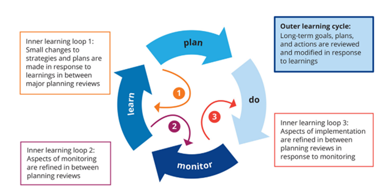

# How can we manage decision making within our CO under a high degree of uncertainty, dynamism and com

## **Why is it relevant?**

In contexts of uncertainty, dynamism, and complexity, decision making within Citizen Observatories becomes more challenging as there are multiple unknowns, rapidly changing circumstances, and intricate interconnections between various factors. By gaining insights into effective decision-making strategies, organisers can navigate these complexities and make informed choices that address emerging issues and maximise the impact of the CO. This understanding allows for adaptive and flexible decision making, enabling the CO to respond promptly to new information, adapt strategies, and engage stakeholders in a way that is responsive to evolving needs and dynamics. Additionally, managing decision making under uncertainty and complexity requires careful risk assessment, integration of diverse knowledge sources, and the ability to balance short-term actions with long-term goals, ultimately leading to more resilient and sustainable outcomes within the CO.

## **How can this be done?**

### _Adaptive management for a flexible and iterative approach to decision-making within the CO, based on ongoing monitoring and evaluation of outcomes_

Adopting an adaptive management approach can greatly support decision making within a citizen observatory, particularly when operating under conditions of high uncertainty and complexity. Adaptive management approaches emphasise flexible and iterative processes that allow for continuous monitoring, evaluation of outcomes, and adjustment of strategies based on new information and changing circumstances (Williams & Brown., 2018). This approach enables organisers to respond to uncertainties and complexities effectively, ensuring that decisions remain relevant and impactful.

Key to adaptive management is the development of a comprehensive monitoring strategy. Data should be regularly collected, monitored, and reviewed, allowing for monitoring protocols and action plans to be adjusted if required. This iterative process enables the CO to adapt its strategies based on emerging patterns, challenges, and opportunities, ensuring that decision making remains evidence-based and responsive to the dynamic nature of the observed system (Levin et al., 2013).

Similarly, in the field of natural resource management, the concept of adaptive co-management has been widely studied and applied (Armitage et al. 2012). Adaptive co-management involves collaborative decision making among diverse stakeholders and a continuous learning process through monitoring, evaluation, and adaptation (Folke et al., 2005). This approach has been successfully employed in various COs and citizen science projects, such as the Great Barrier Reef Citizen Science Program in Australia. The program engages citizens in monitoring and reporting on the health of the Great Barrier Reef, allowing for timely identification of threats and informing management decisions (Hesley et al., 2017). Through adaptive co-management, stakeholders are empowered to actively participate in decision making, while feedback loops and regular evaluation support adjustments in response to changing ecological conditions and emerging challenges.

Such approaches allow COs to embrace uncertainty as an opportunity for learning and innovation, fostering resilience and adaptive capacity (Armitage et al., 2012). By continuously monitoring and evaluating outcomes, decision making becomes evidence-driven and responsive to changing dynamics, leading to more effective strategies and improved outcomes in the face of uncertainty and complexity.

A variety of approaches have been identified for the implementation of adaptive management (Norton, 2018). However, commonly all approaches share four concrete, iterative steps: Plan, Do, Monitor, Learn (Webb et al., 2017). This cyclical approach to adaptive management incorporates a learning cycle, highlighting the importance of using lessons learned from previous stages to inform the next.

<figure><figcaption>
Plan, Do, Monitor, Learn Adaptive Management approach (Webb et al., 2017)
</figcaption></figure>

One approach that taps into these iterative learning principles is a six-step approach, that aims to promote creativity when dealing with uncertainty, risk and change (Nyberg, 1999). This approach provides a structured process to simultaneously implement and evaluate actions, and to modify or refine future activities as needed:

1. **Problem Assessment –** Problems can be identified in a variety of ways. One approach is to use facilitated workshops, in which participants define the scope of the issue. Participants can integrate existing knowledge about the system or issue and explore potential outcomes of different actions. To evaluate which actions are most likely to achieve management objectives, explicit forecasts are generated. This process also helps identify crucial gaps in understanding that hinder outcome prediction.
2. **Design –** Creating a plan and monitoring program that offer reliable feedback on the effectiveness of chosen actions. Ideally, the plan should address the identified gaps in understanding from Step 1. Proposed plans or designs should be assessed based on factors such as costs, risks, informativeness, and their ability to meet management objectives.
3. **Implementation –** Implementing the plan
4. **Monitoring** - Focusing on tracking indicators to determine the efficacy of actions in meeting management objectives. It also involves testing the hypothesized relationships that formed the basis for the initial forecasts.
5. **Evaluation** – Comparing actual outcomes to the earlier forecasts, and the reasons behind any disparities are analysed and interpreted.
6. **Adjustment** - Modifying practices, objectives, and the forecast models based on new insights gained. The understanding acquired in each of these six steps may lead to a re-evaluation of the problem, generation of new questions, and exploration of alternative options, forming an ongoing cycle of improvement.

Such approaches have considerable overlap with co-evaluation approaches, such as the MICS Impact Journey Approach (Wehn, Gharesifard & Somerwill, 2021). This approach outlines a methodology for citizen science or CO projects to incorporate a wide range of stakeholders in iterative problem identification, and impact assessment. This approach is comprised of three stages:

1. **Context analysis** – During this stage, stakeholders can reflect on context in which the initiative is being established and identify pathways of change, desired outcomes and impacts. Relevant stakeholders are identified, and political, environmental, social, and economic contexts are evaluated.
2. **Development and validation of an impact journey map** - Relevant domains of change, expected impacts, and expected outcomes are drafted in this stage. Based on this, strategies for achieving desired changes are formulated, and cause and effect relationships are identified. Key impacts are then prioritised by the stakeholders.
3. **Developing an impact monitoring strategy/continuing co-evaluation** - Indicators and methods for measuring indicators are identified, and an overall plan for monitoring and evaluation of citizen science impact is created. If required, context analysis is conducted again at regular intervals to ascertain if the strategy is still appropriate.

## **Useful resources**

**TOOL:** The **MICS Impact Journey Approach** is an accessible methodology that can help guide the development, implementation and impact monitoring of CO and citizen science initiatives, in order to monitor impact across several impact domains

**COOKBOOK**: The **WeObserve Cookbook (WeObserve Consortium, 2021)** provides comprehensive support for CO practitioners, including specific pages on co-design and stakeholder management

**METHODOLOGY**: The **six-step approach to adaptive management (Nyberg, 1999)** aims to promote creativity when dealing with uncertainty, risk and change

**METHODOLOGY:** The **Plan, Do, Monitor, Learn approach to adaptive management (Webb et al., 2017)** is a cyclical approach to adaptive management allowing users to use lessons learned from previous stages to inform the next

## **"You may also be interested in..."**

[How can we manage and resolve conflicts between stakeholders in our CO?](how-can-we-manage-and-resolve-conflicts-between-stakeholders-in-our-co.md)

## **References**

Armitage, D., Plummer, R., Berkes, F., Arthur, R. I., Charles, A. T., Davidson-Hunt, I. J., . . . Wollenberg, E. K. (2012). Adaptive co-management for social–ecological complexity. Frontiers in Ecology and the Environment, 10(6), 407-414.

Folke, C., Hahn, T., Olsson, P., & Norberg, J. (2005). Adaptive governance of social-ecological systems. Annual Review of Environment and Resources, 30, 441-473.

Hesley, D., Burdeno, D., Drury, C., Schopmeyer, S., & Lirman, D. (2017). Citizen science benefits coral reef restoration activities. Journal for Nature Conservation, 40, 94-99.

Levin, S., Xepapadeas, T., Crépin, A. S., Norberg, J., De Zeeuw, A., Folke, C., ... & Walker, B. (2013). Social-ecological systems as complex adaptive systems: modeling and policy implications. Environment and Development Economics, 18(2), 111-132.

Norton, B. G. (2018). Novel Ecosystems: Adaptive Management and Social Values in the Anthropocene.

Nyberg, B. (1999). An Introductory Guide to Adaptive Management for Project Leaders and Participants. Accessed on 25/05/2023 at: [https://www.for.gov.bc.ca/hfp/publications/00185/Introductory-Guide-AM.pdf](https://www.for.gov.bc.ca/hfp/publications/00185/Introductory-Guide-AM.pdf)

Webb, J. A., Watts, R. J., Allan, C., & Warner, A. T. (2017). Principles for monitoring, evaluation, and adaptive management of environmental water regimes. In Water for the Environment (pp. 599-623). Academic Press.

Wehn, U., Gharesifard, M. and Somerwill, L. (2021). D2.7: A finalised version of the conceptual

framework. Deliverable report of project H2020 MICS (grant agreement No 824711)

Williams, B. K., & Brown, E. D. (2018). Double-loop learning in adaptive management: The need, the challenge, and the opportunity. Environmental management, 62, 995-1006.
